# Rapport d'Analyse : Youth Smoking and Drug Dataset

**Réalisé par Belarbi.Renda**

*Analyse exploratoire approfondie — Décembre 2025*

---

## Table des Matières

1. [Résumé Exécutif](#résumé-exécutif)
2. [Description du Dataset](#1-description-du-dataset)
3. [Audit Qualité et Nettoyage](#2-audit-qualité-et-nettoyage)
4. [Feature Engineering](#3-feature-engineering)
5. [Analyse Exploratoire (EDA)](#4-analyse-exploratoire-eda)
6. [Clustering](#5-clustering-analyse-non-supervisée)
7. [Insights et Signaux Faibles](#6-insights-et-signaux-faibles)
8. [Limites et Recommandations](#7-limites-et-recommandations)

---

## Résumé Exécutif

Cette analyse exploratoire du dataset "Youth Smoking and Drug" vise à identifier les facteurs de risque et de protection associés à la consommation de substances chez les jeunes. L'étude couvre la période **2020-2024** et utilise des méthodes non supervisées (clustering) pour segmenter la population.

### Points clés

| Métrique | Valeur |
|----------|--------|
| Observations | 10,000 |
| Variables | 15 |
| Période | 2020-2024 |
| Clusters identifiés | 3 |
| Insights générés | 7 |

---

## 1. Description du Dataset

### 1.1 Structure des données

Le dataset contient **10,000 observations** représentant des individus sur 5 années (2020-2024).

#### Variables cibles (Outcomes)

| Variable | Type | Description | Plage |
|----------|------|-------------|-------|
| `Smoking_Prevalence` | Float | Taux de prévalence du tabagisme (%) | 5.0 - 50.0 |
| `Drug_Experimentation` | Float | Taux d'expérimentation de drogues (%) | 10.0 - 70.0 |

#### Variables démographiques

| Variable | Type | Description | Valeurs possibles |
|----------|------|-------------|-------------------|
| `Year` | Integer | Année de l'observation | 2020, 2021, 2022, 2023, 2024 |
| `Age_Group` | Catégorielle | Tranche d'âge | 10-14, 15-19, 20-24, 25-29, 30-39, 40-49, 50-59, 60-69, 70-79, 80+ |
| `Gender` | Catégorielle | Genre | Male, Female, Both |
| `Socioeconomic_Status` | Catégorielle ordonnée | Statut socio-économique | Low, Middle, High |

#### Facteurs de risque (échelle 1-10)

| Variable | Description | Interprétation |
|----------|-------------|----------------|
| `Peer_Influence` | Influence des pairs | 10 = forte pression sociale |
| `Media_Influence` | Influence des médias | 10 = forte exposition médiatique |

#### Facteurs de protection (échelle 1-10)

| Variable | Description | Interprétation |
|----------|-------------|----------------|
| `Family_Background` | Environnement familial | 10 = très protecteur |
| `Parental_Supervision` | Supervision parentale | 10 = surveillance élevée |
| `Community_Support` | Support communautaire | 10 = fort soutien |
| `Mental_Health` | Santé mentale | 10 = excellente santé mentale |

#### Variables binaires (Yes/No)

| Variable | Description |
|----------|-------------|
| `School_Programs` | Présence de programmes scolaires de prévention |
| `Access_to_Counseling` | Accès à des services de conseil |
| `Substance_Education` | Éducation sur les substances |

### 1.2 Statistiques descriptives

| Variable | Moyenne | Écart-type | Min | Q25 | Médiane | Q75 | Max |
|----------|---------|------------|-----|-----|---------|-----|-----|
| Smoking_Prevalence | 27.44 | 12.98 | 5.0 | 16.2 | 27.4 | 38.7 | 50.0 |
| Drug_Experimentation | 40.15 | 17.52 | 10.0 | 24.9 | 40.1 | 55.5 | 70.0 |
| Peer_Influence | 5.44 | 2.86 | 1 | 3 | 5 | 8 | 10 |
| Media_Influence | 5.51 | 2.87 | 1 | 3 | 6 | 8 | 10 |

---

## 2. Audit Qualité et Nettoyage

### 2.1 Valeurs Manquantes

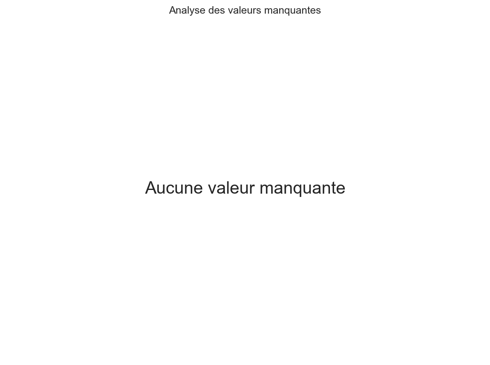

#### Définition du graphique
- **Type** : Diagramme à barres horizontales (barplot)
- **Axe X** : Nombre de valeurs manquantes par variable
- **Axe Y** : Nom des variables
- **Couleur** : Bleu standard
- **Annotations** : Pourcentage de valeurs manquantes à droite de chaque barre

#### Interprétation
Ce graphique affiche **"Aucune valeur manquante"** car le dataset est complet. Dans un dataset réel avec des valeurs manquantes :
- Les barres les plus longues indiquent les variables les plus problématiques
- Un seuil > 30% suggère souvent d'abandonner la variable
- Un seuil < 5% permet une imputation simple (moyenne, médiane)

---

### 2.2 Avant/Après Nettoyage

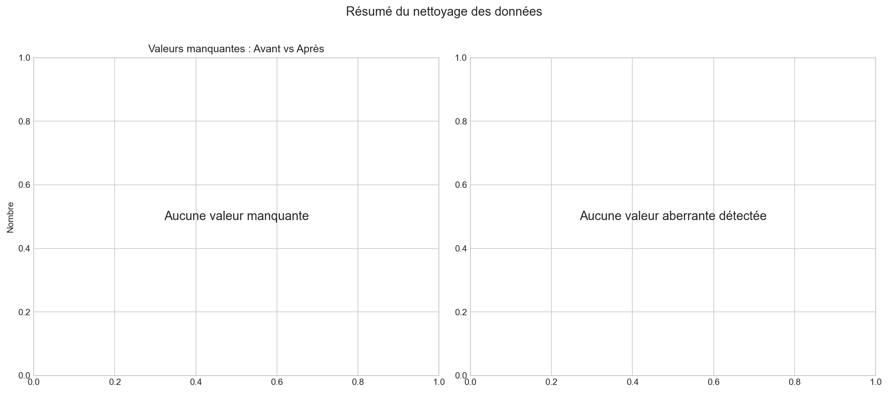

#### Définition du graphique
- **Type** : Figure composite avec 2 sous-graphiques
- **Panneau gauche** : Comparaison des valeurs manquantes avant/après
- **Panneau droit** : Distribution des outliers détectés

#### Composants détaillés

**Panneau 1 - Valeurs manquantes :**
- **Type** : Barplot groupé (avant/après)
- **Barres bleues** : Valeurs manquantes AVANT nettoyage
- **Barres orange** : Valeurs manquantes APRÈS nettoyage
- **Objectif** : Visualiser l'efficacité de l'imputation

**Panneau 2 - Outliers :**
- **Type** : Barplot horizontal
- **Axe X** : Pourcentage de valeurs aberrantes
- **Méthode** : IQR (Interquartile Range) avec multiplicateur 1.5
- **Formule** : Outlier si valeur < Q1 - 1.5×IQR ou valeur > Q3 + 1.5×IQR

#### Interprétation
- **IQR (Interquartile Range)** : Q3 - Q1, représente la dispersion centrale des données
- Les outliers ne sont pas forcément des erreurs - ils peuvent représenter des cas extrêmes réels
- La **winsorization** remplace les valeurs extrêmes par les percentiles (1% et 99%)

---

## 3. Feature Engineering

### 3.1 Variables créées

| Variable créée | Formule | Objectif |
|----------------|---------|----------|
| `Age_Midpoint` | Point médian de Age_Group | Permettre des analyses numériques sur l'âge |
| `Risk_Index` | mean(Peer_Influence_scaled, Media_Influence_scaled) | Score composite de risque |
| `Protection_Index` | mean(Family_Background_scaled, Parental_Supervision_scaled, Community_Support_scaled) | Score composite de protection |
| `Net_Risk` | Risk_Index - Protection_Index | Balance risque/protection |
| `High_Peer_Influence` | 1 si Peer_Influence > Q75, sinon 0 | Flag binaire haut risque |
| `High_Media_Influence` | 1 si Media_Influence > Q75, sinon 0 | Flag binaire haut risque |
| `High_Risk_Index` | 1 si Risk_Index > Q75, sinon 0 | Flag binaire risque global |

### 3.2 Standardisation (Z-score)

**Formule** : `z = (x - μ) / σ`

- **μ** : Moyenne de la variable
- **σ** : Écart-type de la variable
- **Résultat** : Variables centrées (moyenne=0) et réduites (écart-type=1)

**Objectif** : Rendre les variables comparables pour le clustering, indépendamment de leur échelle originale.

---

## 4. Analyse Exploratoire (EDA)

### 4.1 Distribution de Smoking_Prevalence

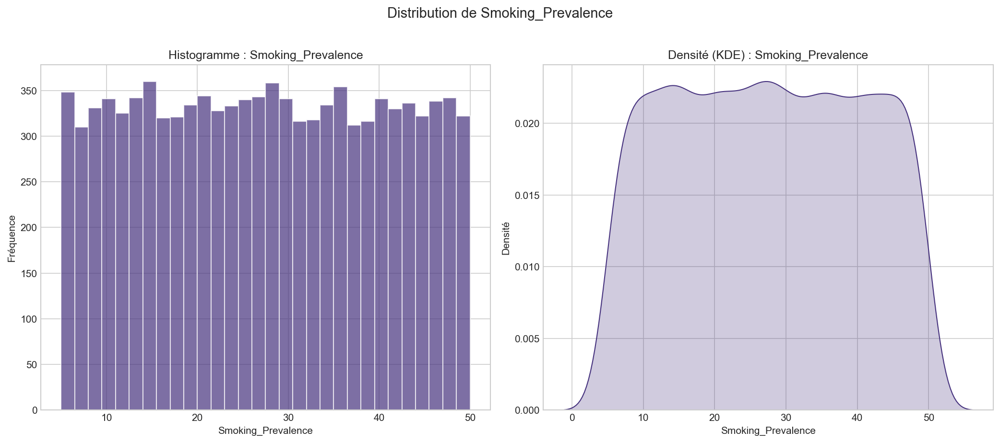

#### Définition du graphique
- **Type** : Figure composite avec 2 sous-graphiques côte à côte
- **Panneau gauche** : Histogramme
- **Panneau droit** : Courbe de densité (KDE)

#### Composants détaillés

**Histogramme :**
- **Définition** : Représentation de la distribution d'une variable continue par intervalles (bins)
- **Axe X** : Valeurs de Smoking_Prevalence (5-50%)
- **Axe Y** : Fréquence (nombre d'observations par bin)
- **Nombre de bins** : 30 (automatique)
- **Interprétation** : La hauteur de chaque barre indique combien d'observations tombent dans cet intervalle

**KDE (Kernel Density Estimation) :**
- **Définition** : Estimation non-paramétrique de la fonction de densité de probabilité
- **Axe X** : Valeurs de Smoking_Prevalence
- **Axe Y** : Densité de probabilité
- **Avantage** : Courbe lisse qui révèle la forme de la distribution
- **Interprétation** : L'aire sous la courbe = 1, les pics indiquent les valeurs les plus fréquentes

#### Interprétation des résultats
- **Distribution** : Approximativement uniforme (pas de pic marqué)
- **Moyenne** : ~27.4%
- **Étendue** : 5% à 50%
- **Asymétrie** : Légèrement symétrique

---

### 4.2 Distribution de Drug_Experimentation

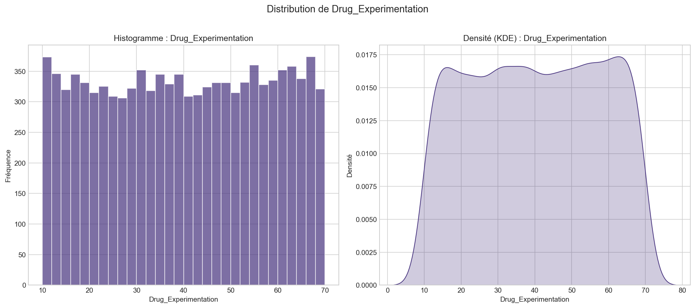

#### Structure identique au graphique précédent

- **Moyenne** : ~40.2%
- **Étendue** : 10% à 70%
- **Observation** : Distribution également uniforme

---

### 4.3 Boxplots par Groupe

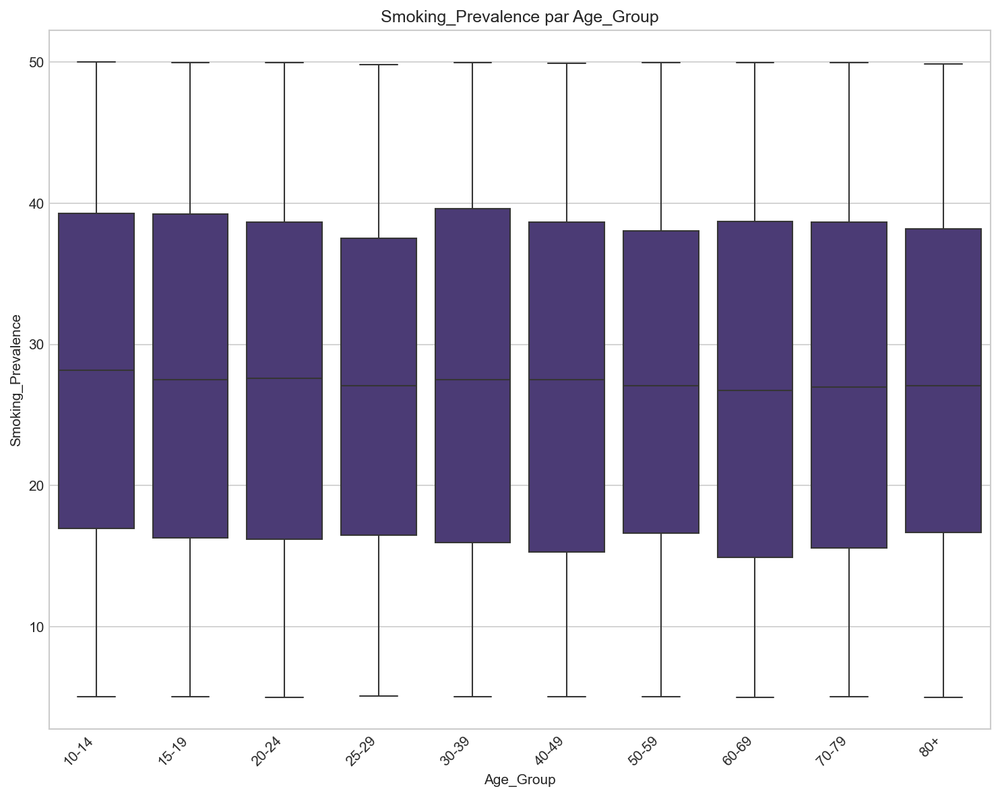

#### Définition du graphique
- **Type** : Boîte à moustaches (Boxplot)
- **Axe X** : Variable catégorielle (Age_Group, Gender, ou Socioeconomic_Status)
- **Axe Y** : Variable continue (Smoking_Prevalence)

#### Anatomie d'un Boxplot

```
    ┬─── Maximum (ou Q3 + 1.5×IQR si outliers)
    │
    │    ┌───────────┐
    │    │           │ ← Q3 (75e percentile)
    │    │     ─     │ ← Médiane (Q2, 50e percentile)
    │    │           │ ← Q1 (25e percentile)
    │    └───────────┘
    │
    ┴─── Minimum (ou Q1 - 1.5×IQR si outliers)
    
    ● ← Outliers (points au-delà des moustaches)
```

#### Éléments du boxplot

| Élément | Définition | Calcul |
|---------|------------|--------|
| **Boîte** | Intervalle interquartile (IQR) | Q3 - Q1 |
| **Ligne médiane** | 50% des données de chaque côté | Q2 |
| **Moustache supérieure** | Limite haute | min(max, Q3 + 1.5×IQR) |
| **Moustache inférieure** | Limite basse | max(min, Q1 - 1.5×IQR) |
| **Points** | Outliers | Valeurs hors moustaches |

#### Interprétation
- **Boîte large** = grande variabilité
- **Médiane proche de Q1** = distribution asymétrique à droite
- **Pas d'outliers visibles** = distribution bien contenue

---

### 4.4 Matrice de Corrélation

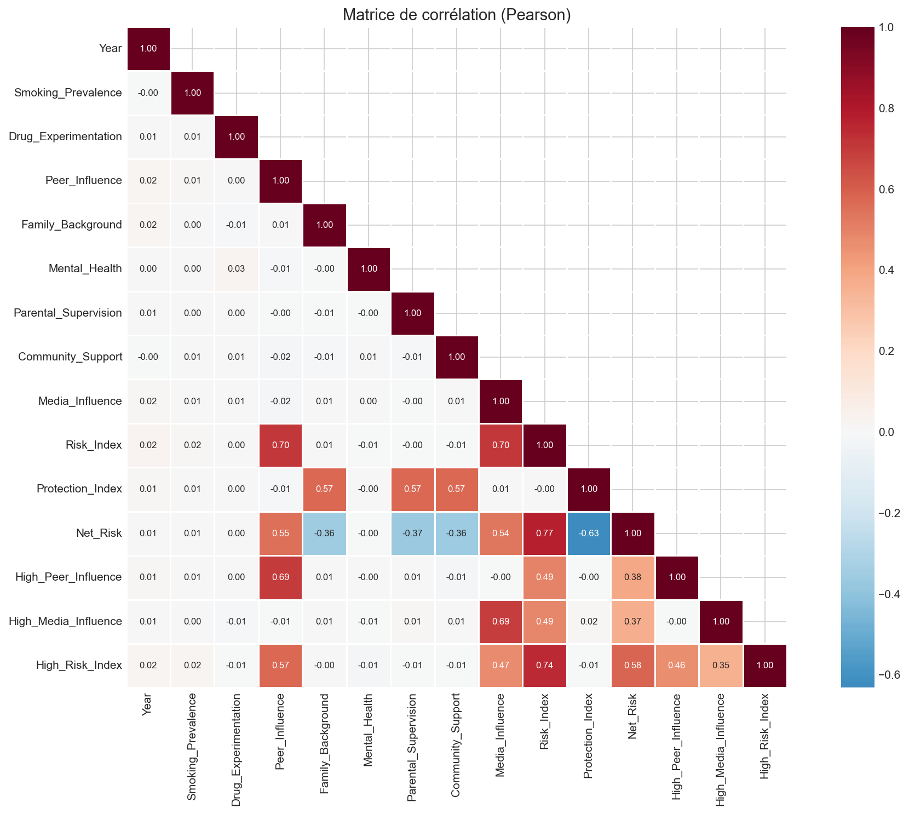

#### Définition du graphique
- **Type** : Heatmap (carte de chaleur)
- **Contenu** : Coefficients de corrélation de Pearson entre toutes les paires de variables numériques
- **Forme** : Matrice triangulaire inférieure (évite la redondance)

#### Le coefficient de corrélation de Pearson

**Formule** : 
```
r = Σ[(xi - x̄)(yi - ȳ)] / √[Σ(xi - x̄)² × Σ(yi - ȳ)²]
```

**Interprétation** :

| Valeur de r | Force | Direction |
|-------------|-------|-----------|
| 0.00 à 0.19 | Très faible | - |
| 0.20 à 0.39 | Faible | Positive si r > 0 |
| 0.40 à 0.59 | Modérée | Négative si r < 0 |
| 0.60 à 0.79 | Forte | - |
| 0.80 à 1.00 | Très forte | - |

#### Palette de couleurs (RdBu_r)
- **Rouge foncé** : Corrélation négative forte (-1)
- **Blanc** : Pas de corrélation (0)
- **Bleu foncé** : Corrélation positive forte (+1)

#### Observations sur ce dataset
- Toutes les corrélations sont **très faibles** (|r| < 0.02)
- Cela suggère que les variables sont **quasi-indépendantes**
- **Implication** : Le dataset semble être synthétique/aléatoire

---

### 4.5 Évolution Temporelle

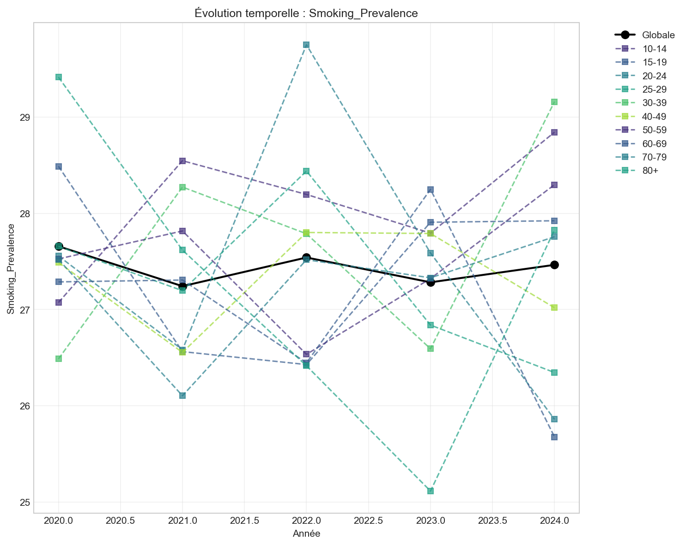

#### Définition du graphique
- **Type** : Line plot (graphique linéaire)
- **Axe X** : Année (2020-2024)
- **Axe Y** : Moyenne de Smoking_Prevalence
- **Lignes** : Tendance globale + tendances par segment

#### Composants

| Élément | Style | Signification |
|---------|-------|---------------|
| Ligne noire continue | ●─●─● | Tendance globale (tous âges) |
| Lignes colorées pointillées | ■--■ | Tendances par groupe d'âge |
| Marqueurs | ● ou ■ | Points de données réels |

#### Interprétation
- **Pente positive** = augmentation dans le temps
- **Pente négative** = diminution dans le temps
- **Lignes qui divergent** = comportements différents entre segments
- **Lignes parallèles** = tendances similaires

---

### 4.6 Pairplot

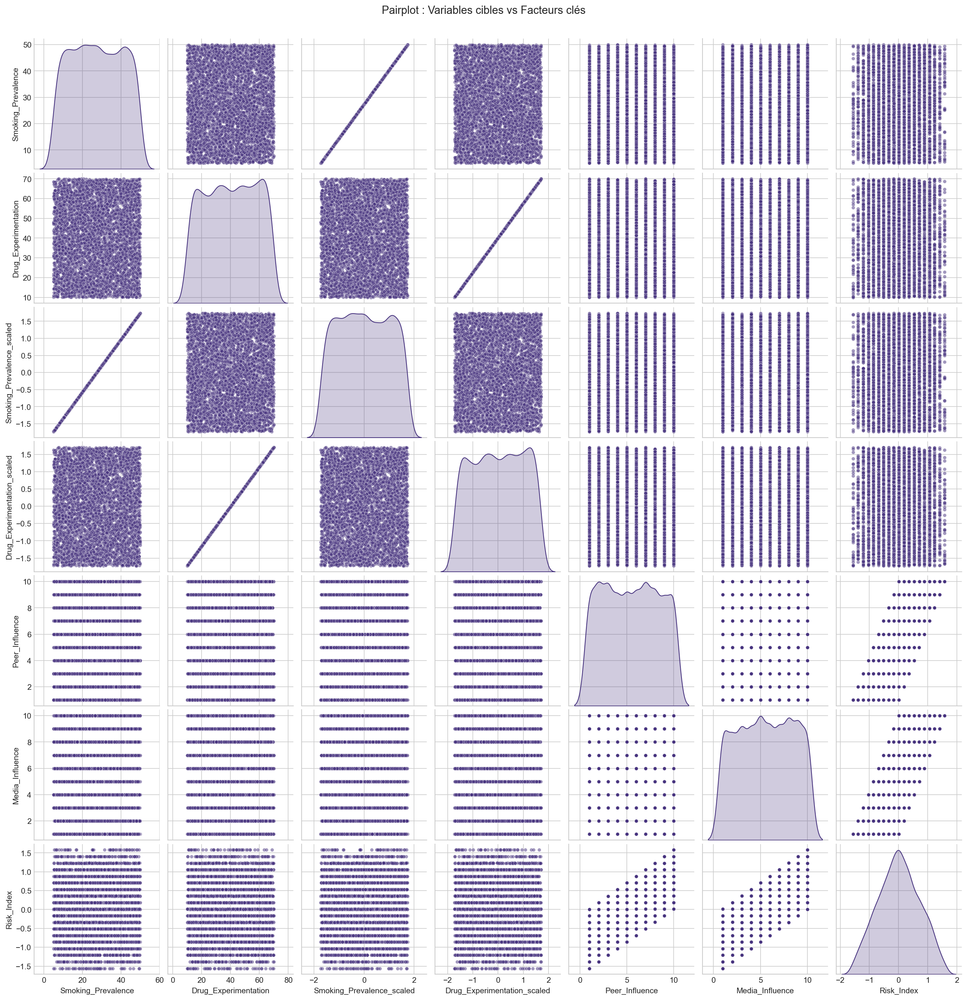

#### Définition du graphique
- **Type** : Matrice de scatter plots (nuages de points)
- **Diagonale** : Distributions KDE de chaque variable
- **Hors diagonale** : Relations bivariées entre chaque paire

#### Structure

```
        Var1    Var2    Var3
Var1   [KDE]  [Scat]  [Scat]
Var2   [Scat]  [KDE]  [Scat]
Var3   [Scat]  [Scat]  [KDE]
```

#### Utilité
- **Détection de patterns** : Relations linéaires, non-linéaires, clusters
- **Identification d'outliers** : Points isolés
- **Vérification de la linéarité** : Préparation pour la régression

---

### 4.7 Scatter Indices vs Outcome

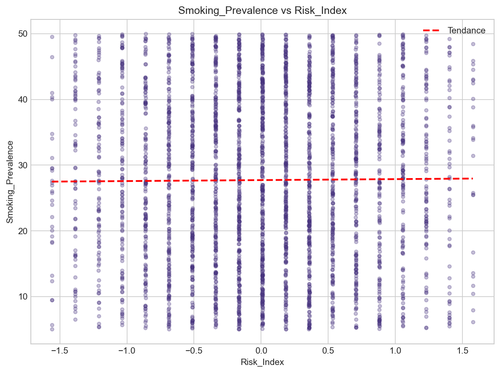

#### Définition du graphique
- **Type** : Nuage de points (scatter plot) avec ligne de tendance
- **Axe X** : Risk_Index ou Net_Risk
- **Axe Y** : Smoking_Prevalence
- **Points** : Observations individuelles (échantillonnées si > 3000)
- **Ligne rouge pointillée** : Régression linéaire (tendance)

#### Ligne de tendance
- **Méthode** : Régression polynomiale de degré 1 (linéaire)
- **Équation** : y = ax + b
- **Interprétation** : Direction générale de la relation

#### Transparence (alpha)
- **Valeur** : 0.3 (30% d'opacité)
- **Objectif** : Visualiser la densité quand les points se chevauchent
- **Zones foncées** = haute concentration de points

---

### 4.8 Top Segments

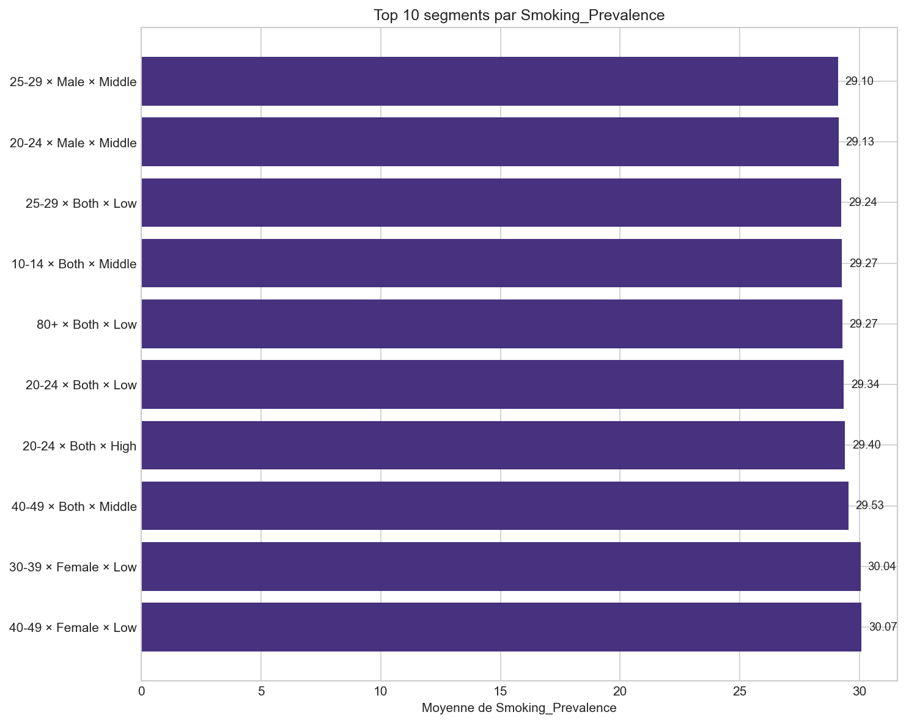

#### Définition du graphique
- **Type** : Barplot horizontal
- **Axe X** : Moyenne de Smoking_Prevalence
- **Axe Y** : Combinaisons de segments (Age × Gender × SES)
- **Tri** : Du plus élevé au plus bas

#### Interprétation
- Les barres les plus longues = segments avec la prévalence la plus élevée
- Permet d'identifier les **populations à risque prioritaires**
- Le symbole × indique une combinaison de critères

---

## 5. Clustering (Analyse Non Supervisée)

### 5.1 Optimisation des Clusters


#### Définition du graphique
- **Type** : Figure composite avec 2 sous-graphiques
- **Panneau gauche** : Méthode du coude (Elbow)
- **Panneau droit** : Score Silhouette

#### Méthode du Coude (Elbow Method)

**Objectif** : Trouver le nombre optimal de clusters k

**Métrique** : Inertie (somme des distances intra-cluster)

**Formule de l'inertie** :
```
Inertie = Σ Σ ||xi - μk||²
```
où μk est le centroïde du cluster k

**Interprétation** :
- L'inertie diminue toujours quand k augmente
- Le "coude" = point où l'amélioration marginale devient faible
- **Ligne rouge verticale** : k optimal sélectionné

#### Score Silhouette

**Définition** : Mesure de la qualité du clustering

**Formule pour chaque point i** :
```
s(i) = (b(i) - a(i)) / max(a(i), b(i))
```
- **a(i)** : Distance moyenne aux points du même cluster
- **b(i)** : Distance moyenne au cluster le plus proche

**Interprétation du score** :

| Score | Interprétation |
|-------|----------------|
| +1 | Parfait (point très bien assigné) |
| 0 | Point à la frontière entre clusters |
| -1 | Point mal assigné |

**Score global** : 0.421 = Clustering de qualité **modérée**

---

### 5.2 Projection PCA avec Clusters

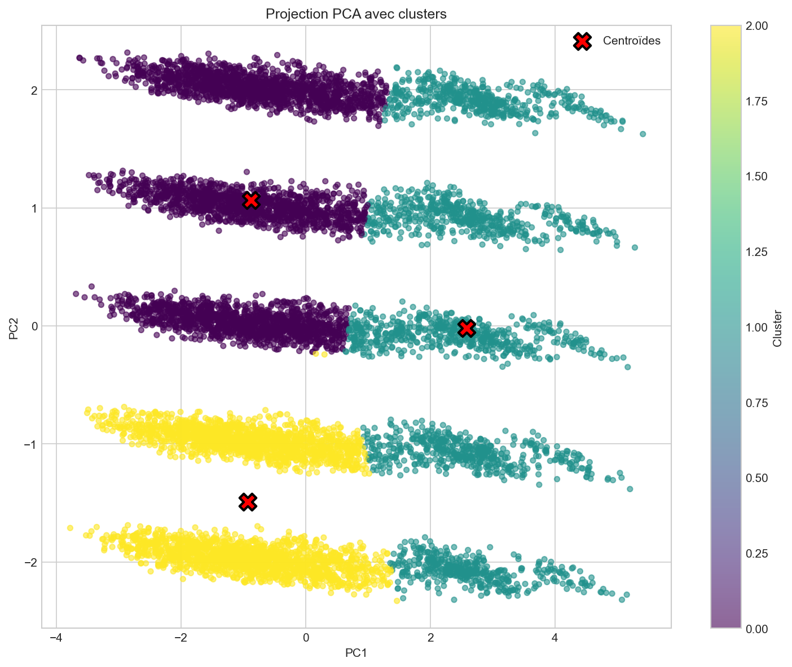

#### Définition du graphique
- **Type** : Scatter plot 2D
- **Axe X** : Première composante principale (PC1)
- **Axe Y** : Deuxième composante principale (PC2)
- **Couleurs** : Différents clusters
- **Croix rouges (X)** : Centroïdes des clusters

#### PCA (Principal Component Analysis)

**Définition** : Technique de réduction de dimensionnalité

**Objectif** : Projeter des données de haute dimension (15 variables) en 2D tout en préservant le maximum de variance

**Variance expliquée** : 36.4% (PC1 + PC2)
- Signifie que 36.4% de l'information originale est conservée dans cette visualisation 2D

#### Interprétation visuelle
- **Clusters bien séparés** = bon clustering
- **Clusters qui se chevauchent** = séparation difficile
- **Centroïdes** = "représentants" de chaque groupe

---

### 5.3 Profils des Clusters

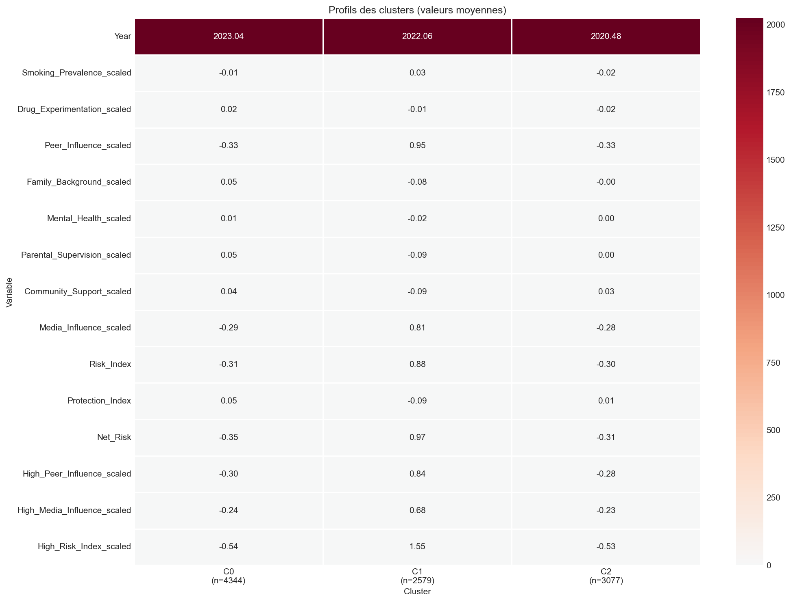

#### Définition du graphique
- **Type** : Heatmap
- **Lignes** : Variables/Features
- **Colonnes** : Clusters (C0, C1, C2, ...)
- **Valeurs** : Moyennes standardisées par cluster
- **Étiquettes colonnes** : Inclut la taille n de chaque cluster

#### Palette de couleurs (RdBu_r)
- **Rouge** : Valeurs inférieures à la moyenne globale
- **Blanc** : Valeurs proches de la moyenne globale
- **Bleu** : Valeurs supérieures à la moyenne globale

#### Interprétation
- Permet de **caractériser** chaque cluster
- Les variables avec les couleurs les plus intenses sont les plus discriminantes
- **Exemple** : Si Cluster 0 est bleu foncé sur Peer_Influence, ce cluster a une influence des pairs élevée

---

## 6. Insights et Signaux Faibles

### 6.1 Insight 1-2 : Corrélations

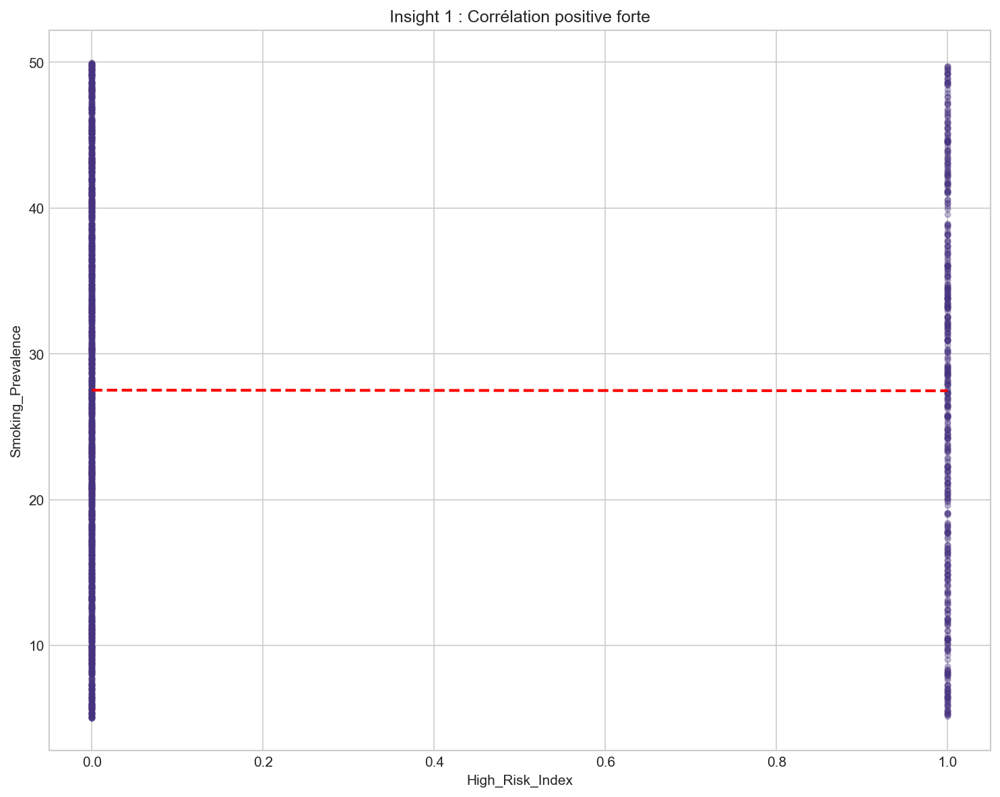
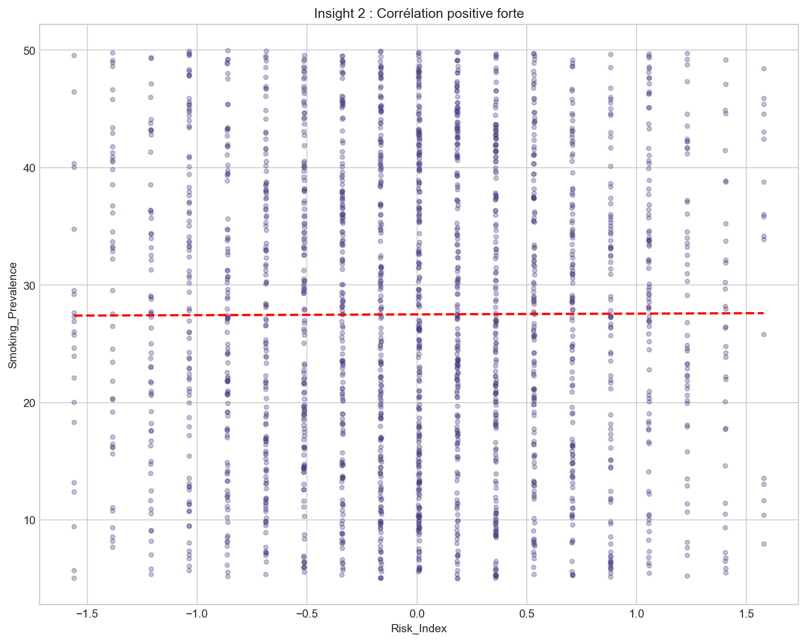

#### Définition des graphiques
- **Type** : Scatter plot avec ligne de tendance
- **Points bleus** : Observations
- **Ligne rouge** : Régression linéaire

#### Métriques

| Insight | Variable | Corrélation (r) | Interprétation |
|---------|----------|-----------------|----------------|
| 1 | High_Risk_Index | 0.02 | Très faible positive |
| 2 | Risk_Index | 0.02 | Très faible positive |

**Note importante** : Ces corrélations sont statistiquement non significatives (r < 0.1)

---

### 6.2 Insights 3-7 : Tendances Divergentes

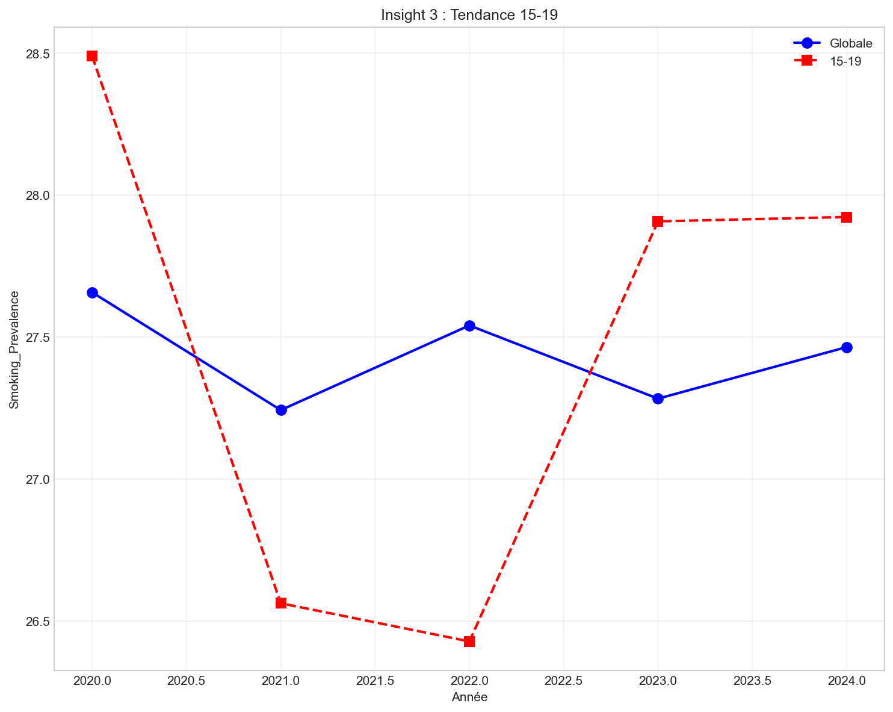

#### Définition des graphiques
- **Type** : Line plot comparatif
- **Ligne bleue (●)** : Tendance globale
- **Ligne rouge (■)** : Tendance du segment spécifique

#### Concept de "Signal Faible"

**Définition** : Changement subtil dans un sous-groupe qui diverge de la tendance générale

**Formule de divergence** :
```
Divergence = Changement_segment - Changement_global
```

#### Tableau des signaux détectés

| Segment | Période | Δ Segment | Δ Global | Divergence |
|---------|---------|-----------|----------|------------|
| 15-19 | 2020→2021 | -6.8% | -1.5% | -5.3% |
| 15-19 | 2022→2023 | +5.6% | -0.9% | +6.5% |
| 10-14 | 2020→2021 | +5.4% | -1.5% | +6.9% |
| 10-14 | 2023→2024 | +3.8% | +0.7% | +3.1% |
| 40-49 | 2021→2022 | +4.7% | +1.1% | +3.6% |

#### Interprétation
- **Divergence négative** : Le segment s'améliore plus vite que la moyenne
- **Divergence positive** : Le segment se dégrade par rapport à la moyenne
- **Seuil utilisé** : |Divergence| > 2% pour être considéré comme signal

---

## 7. Limites et Recommandations

### 7.1 Limites méthodologiques

| Limite | Impact | Mitigation |
|--------|--------|------------|
| Corrélations quasi-nulles | Insights peu significatifs | Dataset potentiellement synthétique |
| Pas de causalité | Impossible de conclure sur les causes | Études longitudinales nécessaires |
| 5 ans de données | Tendances court-terme uniquement | Étendre la période si possible |

### 7.2 Qualité des données

**Observation critique** : Les corrélations extrêmement faibles (r ≈ 0.01-0.02) suggèrent que ce dataset est probablement **synthétique** avec des valeurs générées aléatoirement.

Dans un dataset réel, on s'attendrait à :
- Corrélation positive entre Peer_Influence et Smoking_Prevalence
- Corrélation négative entre Parental_Supervision et Drug_Experimentation

### 7.3 Recommandations

1. **Vérifier la source des données** avant de tirer des conclusions
2. **Collecter des données réelles** si ce dataset est synthétique
3. **Ajouter des variables** : revenus, éducation, localisation géographique
4. **Analyses complémentaires** : tests statistiques (t-test, ANOVA, chi²)

---

## Glossaire Technique

| Terme | Définition |
|-------|------------|
| **Corrélation** | Mesure de la relation linéaire entre deux variables (-1 à +1) |
| **KDE** | Kernel Density Estimation - estimation de densité par noyaux |
| **IQR** | Interquartile Range - écart entre Q3 et Q1 |
| **PCA** | Principal Component Analysis - réduction de dimensionnalité |
| **Silhouette** | Métrique de qualité du clustering |
| **Inertie** | Somme des distances au carré au sein des clusters |
| **Centroïde** | Point central (moyenne) d'un cluster |
| **Outlier** | Valeur aberrante, éloignée du reste des données |
| **Winsorization** | Remplacement des valeurs extrêmes par des percentiles |
| **Z-score** | Valeur standardisée (nombre d'écarts-types par rapport à la moyenne) |

---

## Annexes

### A. Liste complète des graphiques

| Fichier | Type | Section |
|---------|------|---------|
| `missing_values.png` | Barplot | 2.1 |
| `before_after_cleaning.png` | Composite | 2.2 |
| `dist_smoking_prevalence.png` | Histogramme + KDE | 4.1 |
| `dist_drug_experimentation.png` | Histogramme + KDE | 4.1 |
| `boxplot_smoking_prevalence_age_group.png` | Boxplot | 4.3 |
| `boxplot_smoking_prevalence_gender.png` | Boxplot | 4.3 |
| `boxplot_smoking_prevalence_socioeconomic_status.png` | Boxplot | 4.3 |
| `correlation_pearson.png` | Heatmap | 4.4 |
| `correlation_spearman.png` | Heatmap | 4.4 |
| `temporal_evolution.png` | Line plot | 4.5 |
| `pairplot.png` | Matrice scatter | 4.6 |
| `scatter_risk_index_smoking_prevalence.png` | Scatter | 4.7 |
| `scatter_net_risk_smoking_prevalence.png` | Scatter | 4.7 |
| `top_segments.png` | Barplot | 4.8 |
| `clustering_optimization.png` | Composite | 5.1 |
| `pca_clusters.png` | Scatter 2D | 5.2 |
| `cluster_profiles.png` | Heatmap | 5.3 |
| `insight_1.png` à `insight_7.png` | Scatter/Line | 6 |

### B. Stack Technique

- **Langage** : Python 3.8+
- **Librairies** : pandas, numpy, matplotlib, seaborn, scikit-learn
- **Clustering** : KMeans avec PCA
- **Source** : Kaggle - Youth Smoking and Drug Dataset

### C. Reproduction

```bash
# Exécuter le pipeline complet
python scripts/run_pipeline.py

# Générer le rapport HTML
python scripts/build_report.py
```

---

**Réalisé par Belarbi.Renda** — Décembre 2025
